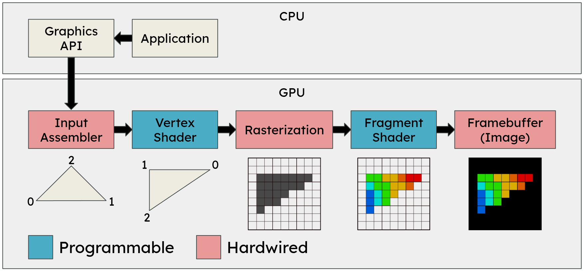
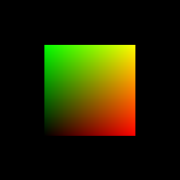
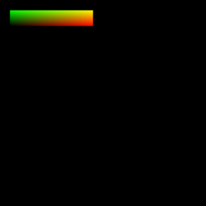
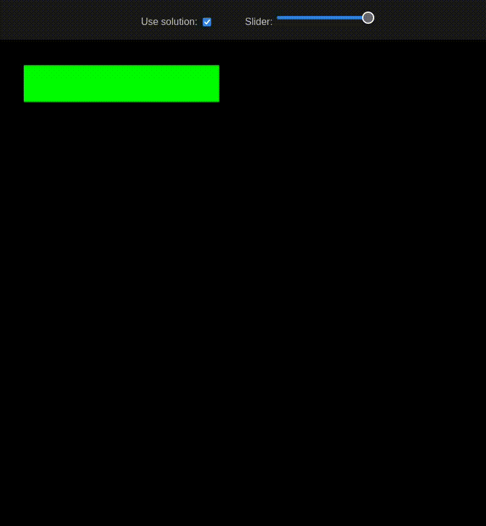
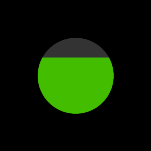
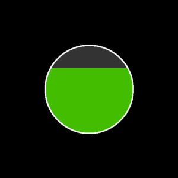
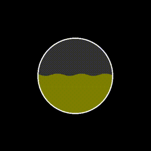

# Setup

## Recap: The Graphics Pipeline

Unlike standard CPU programs, the GPU excels at parallel processing (SIMD): It handling thousands of vertices and millions of pixels simultaneously. It is important to remember that APIs like WebGL are strictly rasterization engines, not fully-featured 3D libraries. They have no built-in concepts of cameras, lights, or scenes. They only draw primitives (like triangles or lines). All 3D transformations and coloring are up to us.

To achieve this, data flows through the **Graphics Pipeline**, with two main programmable stages:
- **Vertex Shader:** Processes individual vertices and calculates their final positions on the screen.
- *Rasterization (Automatic):* Converts the assembled primitives into pixels.
- **Fragment Shader:** Calculates the final color for each individual pixel.

We communicate with these shaders using three main types of data:
- **Attributes:** Per-vertex data (e.g., individual positions or normals). This data is defined in the `vertexList` array in the file `mesh-data.js`.
- **Uniforms:** Data that remains constant across all vertices and pixels during a single draw call (e.g., an overall color or time variable).
- **Varyings:** Data calculated in the vertex shader and passed down to the fragment shader.

## Usage with Visual Studio Code

1. Open the folder where this file (`README.md`) is located with VSCode (`File` > `Open Folder...`).
2. Install the Extension [Live Server](https://marketplace.visualstudio.com/items?itemName=ritwickdey.LiveServer). With this extension you can launch a local static file server.
3. Right-click `index.html` of the exercise you want to work on and click `Open with Live Server`.
4. The website opens in your default browser. Everytime you save a file in VSCode, the browser tab gets refreshed.
5. Install the Extension [Shader languages support for VS Code](https://marketplace.visualstudio.com/items?itemName=slevesque.shader) to get syntax highlighting for the shaders we will write.

# Exercise 4: Healthbar Shader

Modify `shader.vert` and `shader.frag` according to the tasks.

Solution for 1-5: `solution.vert`, `solution.frag`

Solution for 6-8: `solution_6_7_8.vert`, `solution_6_7_8.frag`

> Remember to check the console (F12) for errors!

## 1. Correct UVs

Modify the UV coordinates so they are at (0,0) in the lower left corner and (1,1) in the upper right corner.

## 2. Scaling and Positioning

- Scale the quad so it has the rectangular shape of a typical healthbar and move it to the top left.
  - Hint: Modify the position in the vertex shader.

## 3. Color depending on the Slider

- When the slider is at 1.0, the healthbar should be green.
- When the slider is at 0.0, the healthbar should be red.
- Any values in between should be interpolated (so for example 0.5 should be a mix between red and green).
  - Hint: Use the function `mix`, that linearly interpolates between two values.

## 4. Display grey on the empty part of the Healthbar

- Use a grey color for the empty part of the healthbar.
  - Hint: Use the UV coordinates to figure out where on the healthbar the current fragment is located.

## 5. Flash at low health

- Make the healthbar flash, when the slider value is below 0.2 .
  - Hint: The uniform `u_time` contains the time in seconds since the page was loaded.

After completing all  of the above, your healthbar should now look and behave like this:

## (Bonus) 6. Make the Healthbar round

- Undo the scaling and positioning of 2.
- Make the shape round
  - Hint: Calling `discard;` in the fragment shader prevents the fragment from being drawn. This way you can make the fragment transparent.
  - Hint: You can use the function `distance` to get the distance between two points.
- Make the healthbar fill in the y direction instead of x direction.

## (Bonus) 7. Add a Border

- Add a white border around the edge of the circle.

## (Bonus) 8. Animated Waves

- Make the transition to grey wavey.

